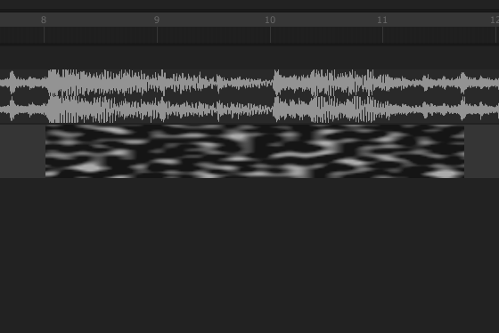

# Animating Parameters

Every parameter of a Light Block can be animated using keyframes (numeric parameters and colors). You can start by right-clicking on the Light Block and selecting "Edit" and the respective parameter. This will enable a curve automation and create two keyframes directly on the Light Block preview.&#x20;

* You can move the keyframes by dragging them.&#x20;
* You can create new keyframes with a double-click on the Light Block.&#x20;
* You can change the interpolation between keyframes by clicking the line between two keyframes.

If you want to control an additional parameter with an automation curve, again right-click on the Light Block and select the new parameter. This will switch the curve keyframe to the newly selected parameter.


When you are done editing, right-click on the Light Block and select "Clear automation editor". This will let you manipulate the Light Block in the usual way.


<figure><figcaption></figcaption></figure>
