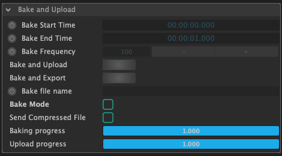
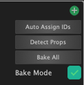

# Uploading a Sequence to Props

You can upload a timeline/sequence onto the SD card of the prop. This has the following advantages over the usual live streaming of colors:&#x20;

* Baking sequences guarantees **smooth playback at hight framerates**&#x20;
  * WiFi communication does not guarantee smooth timing. \
    Try to compare a strobe light block with a high strobe frequency in streaming and baked mode.&#x20;
* The sequence can be **played independently** without Bento running.&#x20;
  * It can be started through OSC and the Serial commands of the Command API.
  * A typical use case for that is to use a OSC timeline software (e.g. [Chataigne](http://benjamin.kuperberg.fr/chataigne)) that can also integrate other elements of the show, e.g. stage light, music, projections.

## How to upload the timeline?&#x20;

Make sure you **give your timeline a name**. This is the name that will be used to save the sequence on the SD card. You can change the name of your timeline by clicking on the timeline light block in the block panel. This will show the properties of the timeline in the inspector. Then double-click on the label just below "Inspector" and enter the name.

Make sure to assign the timeline light block to all the props you want to bake/upload the sequence to. You can do that from the timeline parameters in the inspector and pressing the **"Assign To All"** button.&#x20;

Now you can use the "Bake to props" button from the inspector when having the timeline light block selected. Or use the "**Bake all"** button in the props panel. You will see the progress of the baking (creating the upload data) in orange and upload in green as an overlay on the props in the props panel. You will also see a visual progress indication on the physical prop.&#x20;


You can check the Logger panel for debug information of the baking process.


### How to get more control over the baking process

Select the prop inside of the prop panels. The inspector will show its properties. In the container called "Bake and Upload" you will find a detailed controls for the baking process.


By default, the fps of the timeline is used as the bake frequency. If you want to use a higher frequency you can manually set the bake frequency  here.


## How to play a baked sequence

You can control playback of baked sequences from the UI of Bento or through the OSC and Serial [Command API](../advanced-topics/firmware-components/command-api.md#player-control).&#x20;

### Use Bento to control playback

There is two ways to control the playback of a backed sequence inside of Bento. The first option is to use the "Show" Container in the prop panel parameters:

* **Click on the Prop panel**, so that its parameters are displayed in the Inspector panel.&#x20;
* You can input the **name of the sequence** to load into the **"Show filename"** parameter.&#x20;
* Press the **"Load all"** Button, to load the sequence.
* Press **"Play all"** to play the sequence on all props.

The second option is to use the timeline controls:

* Make sure you have the **timeline block assigned to the props**.&#x20;
* **Enable the Bake Mode toggle** in the Props panel
  * This will switch the props from streaming mode into baked mode. The colors that you are seeing on the clubs are now coming from the SD card.
* Now the **playhead of the Sequence Editor will control the time** of the baked sequence.
* Don't forget to disable the "Bake Mode", when you want to live stream colors again!

