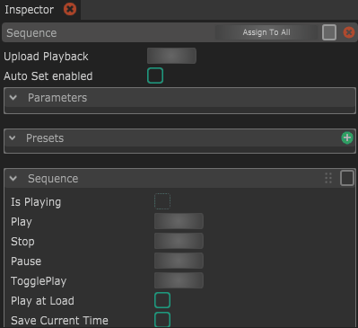
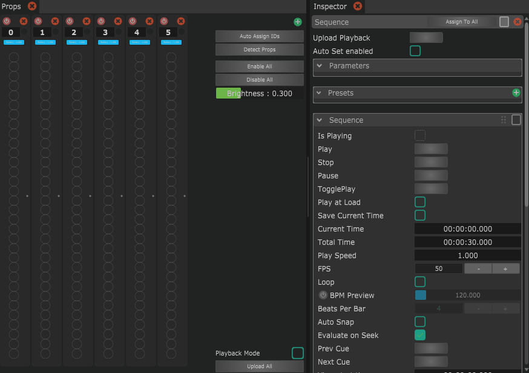

# Filtering

The Layers are blended and selected for Props on different rules. The Blend Mode can be defined in the layer properties in the inspector panel.&#x20;

If you select a Layer you can add Prop filters in the Inspector panel. When you click the green plus icon next  to "Prop Filters" you will get a selection of:

* **ID**: This filter targets a specific Prop ID. (The prop ID is the number displayed for each Prop in the Prop panel)
* Shape: this filter targets a specific shape (e.g. club, ball, hoop, ...)&#x20;
* Cluster: This will target a Cluster of Props of the timeline. How to define a cluster is described below.
* Script: This will run a script to determine if the Layer should be used for the Prop.

## Creating a Cluster Filter

A Cluster Group can help you target an arbitrary defined group of Props differently. This can for example be useful if you want to have different effects for Props that are handled by one person.

To create a new Cluster Group, select the Sequence Light Block in the Blocks panel and in its Inspector parameters click the green plus icon next to "Cluster Groups". This will create a new cluster group.

Inside of a Cluster Group you can define Clusters of Props. For each Cluster you can add Props with their global Prop ID, by clicking the green plus icon next to the Cluster container.&#x20;

The image below shows the creation of a Cluster Group called "Cluster Group" with two Clusters "Julius" and "Daniel".&#x20;

<figure><figcaption>
Creation of a Cluster Group with two Clusters.
</figcaption></figure>

They have a different color associated with each Cluster. This color can be displayed on the Props by selecting the Cluster Group in the Sequence parameter called "Calibration Group" and by activating the parameter "Identity mode". The Cluster Group color will be displayed at the top of the Prop, the local Prop ID will be displayed at the bottom of the Prop. This information is also baked/uploaded to the prop.

<figure><figcaption>
Selecting the Cluster Group as a Calibration Group and enabling Identity Mode will display the Cluster colors in the clubs.
</figcaption></figure>
