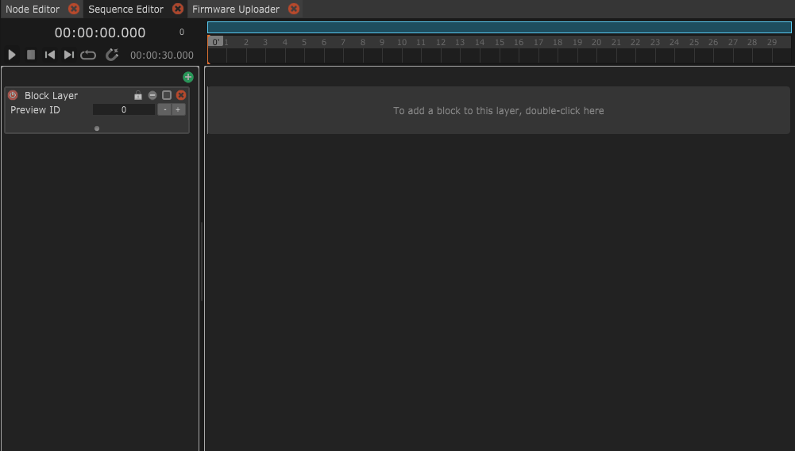
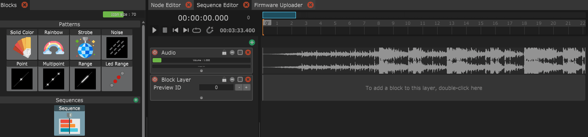
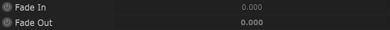
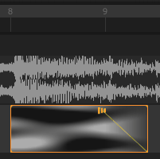
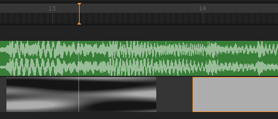
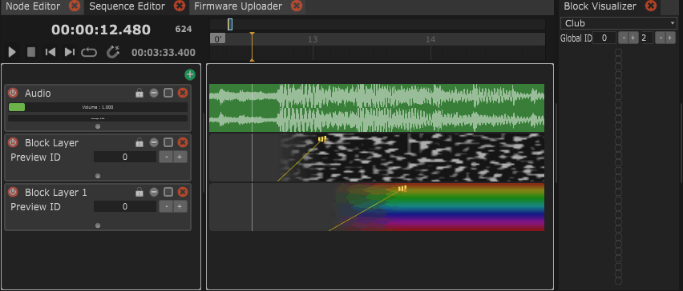

# Layer system + Blend Modes

A Sequence can consist of 3 different Layer types:

* **Blocks Layer**: Let's you arrange Light Blocks over time.
* **Audio Layer**: Add music files.
* **Video Layer** (experimental): Add a video file (e.g. of a choreography) to display in the Video Preview panel.

## Add a music file

To add a music file click the **green plus icon** above the layers and select "**Audio**". Then **double-click** on the created audio layer and select an audio file from the file dialog.

You can fine tune details of the audio block by clicking on it. This will show it's parameters in the inspector panel. Additionally, you can move the block to change it's start time. You can also use the nudges at the beginning and end of the block to crop the music clip.

<figure><figcaption>
Add a music file.
</figcaption></figure>

## Add Light Blocks

You can add Light Blocks to a Block Layer in the following ways:

* **Drag and Drop** a Light Block from the Blocks panel onto the Block Layer.
* **Double-clicking on the Block Layer** will create an empty Block. You can then set a Light Block in its Inspector parameters.
* **Copy and Paste from other layers**: Select Light Block, press Ctrl+C => select Layer, press Ctrl+V

The Light Blocks will display a visual representation of the output.

<figure><figcaption>
Adding a Noise Light Block with Drag and Drop.
</figcaption></figure>

## Fade in / Fade out on a Block

You can add a smooth fade-in or fade-out to each light block. Click the Light Block to show its parameters in the Inspector. Then enable the "Fade out" parameter and change the value.

<figure><figcaption>
Add a Fade out.
</figcaption></figure>

After you have activated the "Fade Out" parameter, you can fine adjust the timing on the Light Block.

<figure><figcaption>
Fine adjust the Fade Out on the Light Block.
</figcaption></figure>

## Crossfade Blocks

To crossfade between two Blocks you simply need to drag the Blocks towards each other. Make sure to disable the "Fade Out" on the first Light Block and the "Fade In" parameter on the second Light Block. You will see two blue lines that illustrate the crossfade.

<figure><figcaption>
Creating a crossfade between two Light Blocks.
</figcaption></figure>

## Multiple Layers + Blend Modes

You can add several Block Layers to a Sequence. For each Layer you can define the Blend Mode in its Inspector parameters. The Blend Mode defines how the Layer is combined with the Layer below. You can use three different Blend Modes: Add, Alpha, or Mask.

<figure><figcaption>
A Noise and a Rainbow are combined with Blend Mode "Add".
</figcaption></figure>

