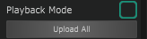

# Streaming vs. Playback Mode

There are two modes to display Sequence colors on your Prop:

* Streaming Mode
* Playback Mode

## Streaming Mode

The Streaming Mode is activated by default. The color information is streamed in real-time to the Prop. This means that changes to the Light Blocks will immediately be visible on the Prop. This is perfect when you are creating a new show.&#x20;


As the colors are streamed in real-time the Props will also need a constant WiFi connection. If the WiFi connection is lost, the Props will not be able to display any colors. This is why we recommend using the Playback Mode for most performance situations.


## Playback Mode

In Playback Mode the Prop will play the color sequence information stored on the Prop memory. This has the advantage that you can have butter smooth playback in high framerates without the need for a constant WiFi connection.

Befor you can actually play a Sequence in Playback Mode you need to [upload the sequence](../software/baking-uploading-of-sequences.md).&#x20;

You can activate the Playback Mode in the lower right corner of the Props panel.&#x20;

<figure><figcaption>
Activate Playback Mode in the Props panel.
</figcaption></figure>


We recommend using Playback Mode for most performance situations. It allows for butter smooth playback in high framerates and does not need a constant WiFi connection.&#x20;

The disadvantage is that you will not be able to immediately see changes to your Sequence. You first need to upload.

