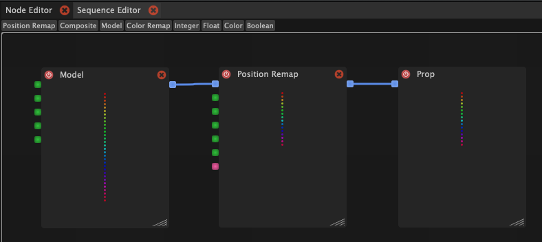

# Introduction

This is where you will output your result at the end. At top of panel you have a list with all node types. You can drag and drop them on to the free space below.

The following picture illustrates a simple workflow:

1. Uses a Model node to load the rainbow light block
2. Uses a Position Remap node to reposition the effect to the upper half of the prop
3. Outputs it to the Prop model

The blue wires and ports indicate that resulting colors are passed between the nodes. Green wires and ports indicate that simple values like numbers (integer or float) or boolean) are passed. Pink wires and ports indicate that a single color is passed.

You can use the following nodes to create and combine color effects:

* **Model**: Load a light block as an input
* **Composite**: Combine two colors inputs (e.g. from two different models) using different blend modes.
* **Position Remap**: Reposition the effect
* **Color Remap**: Replaces color values from the input based on brightness, hue or saturation by colors from a gradient

You can use the following nodes to create parameters that can be controlled from the inspector or inside of the timeline and be used as input for the other nodes.

* **Integer**
* **Float**
* **Color**
* **Boolean**


Please read the following instruction on how parameters of light blocks are inherited and overriden in Nodes:\
[Inheritance / overriding of parameters](../light-blocks/light-blocks.md#inheritance-overriding-of-parameter-values)

