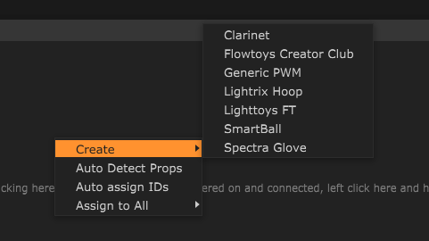
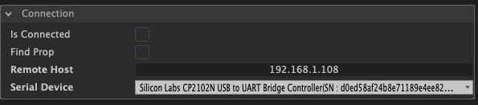
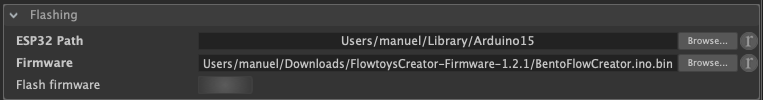
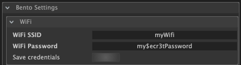

# Installation

## Flashing the Props

You can use Bento upload the firmware to your props. At the moment it uses the Arduino IDE in the background to do the flashing. 


Flashing of props is currently **implemented for Windows and MacOS**, but not for Linux.


### **Preparation steps**

* Download and **install the Arduino IDE** from [https://www.arduino.cc/en/main/software](https://www.arduino.cc/en/main/software)
* [**Install the ESP32 board definition**](https://github.com/espressif/arduino-esp32#installation-instructions) ****
  * Start Arduino and open the Preferences window
  * Copy the link below into the _Additional Board Manager URLs_ field.  [https://raw.githubusercontent.com/espressif/arduino-esp32/gh-pages/package\_esp32\_index.json](https://raw.githubusercontent.com/espressif/arduino-esp32/gh-pages/package_esp32_index.json)
  * Open Boards Manager from Tools &gt; Board menu and install _esp32_ platform.
* **Download the firmware** for your prop
  * e.g. firmware for Flowtoy creator clubs is available from the [Bento Github release page](https://github.com/benkuper/BenTo/releases)


You need to install the following serial driver \(usb\) to enable serial communication with your prop:   
[https://www.silabs.com/products/development-tools/software/usb-to-uart-bridge-vcp-drivers](https://www.silabs.com/products/development-tools/software/usb-to-uart-bridge-vcp-drivers)


### **Flashing the firmware**

* **Create a prop** by clicking on the green plus icon in the "Props" panel, select your prop type \(e.g. Flowtoys Creator Club\).


If you don't see any props when right-clicking in the "Props" panel, you need to update the props at least once. In order to do this, go to the menu "File &gt; Update props definitions"


* Select the prop by clicking on the prop. The inspector will display its parameters.
* In the container "Connection" **select the Serial Device** related to your prop.

* Repeat these steps for all props that you want to flash.
* **Go to menu "File" =&gt; "Preferences"**, scroll down to the container called "Bento Settings" and "Flashing".
* **Select the path to your Arduino IDE** by clicking on "Browse" next to the "ESP32 Path". Typical locations are:
  * On Windows: C:\Program Files \(x86\)\Arduino or C:/Users/myUsername/AppData/Local/Arduino15
  * On MacOS: /Users/myUsername/Library/Arduino15
* **Select the path to the firmware** by clicking on "Browse" next to "Firmware" and select the firmware .bin file \(e.g. BentoFlowCreator.ino.bin\). Makes sure that the partitions .bin file is located in the same folder as the firmware \(e.g. BentoFlowCreator.ino.partitions.bin\)
* **Click on "Flash Firmware"** to flash the props

## Configuring WiFi

* **Connect your props via Serial** \(USB\) connection
* **Create props** in the props panel and **select the correct Serial device** in the "Connections" container of the inspector
* **Go to the menu "File" =&gt; "Preferences"**, scroll down to the containers called **"Bento Settings" and "WiFi"**
* **Enter your WiFi SSID** \(name of WiFi\) and **WiFi password**
* **Press "Save credentials"**, this will send the credentials via the Serial connection to the props

