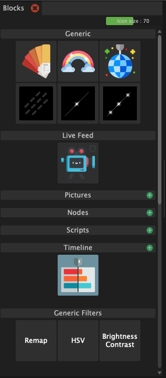
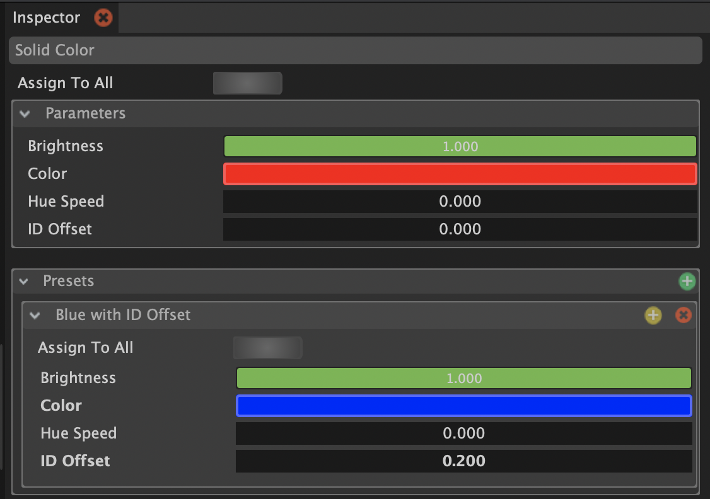

# Introduction

Light blocks are the fundamental building blocks of Bento. These are the light effects that you use to create your light show. There is different categories of Light Blocks:

* [**Generic**](generic.md): Basic light effects.
* [**Live Feed**](live-feed/): Picks colors from a video feed based on a prop location on that video texture.
* [**Pictures**](pictures.md): Uses colors from a picture.
* [**Nodes**](nodes.md): Let's you compose light blocks to a new more complex light block.
* [**Scripts**](scripts.md): You can write your own effects using JavaScript code.
* [**Timeline**](timeline.md): You can arrange lights blocks in a timeline.

## Parameters

Each light block exposes different parameters that affect the output of colors.&#x20;

### Presets

You can create presets for each light block. The parameters shown at the top of the inspector is the "Default" preset. You can create your own preset by clicking on the green plus icon next to "Presets".


Notice how the values and parameter names that are different from the default values are highlighted with bold text. You can reset to the default value by right-clicking on the parameter and selecting "Reset value"


### Inheritance/overriding of parameter values

An important thing to understand is what happens when you use a preset (including the default preset) in a timeline or node. Parameter values can be overridden locally where the timeline is used. The consequence of this is that parameters that are not overridden are directly taken from the preset.&#x20;


**If you change the preset it will change the output of your light block in the timeline and node!**&#x20;



**There is two ways to work around this:**

* **Create a new preset for every light block you want to use in a timeline or node and be careful when changing those presets.**
* **Override all parameter values inside of the timeline or node**


&#x20;
