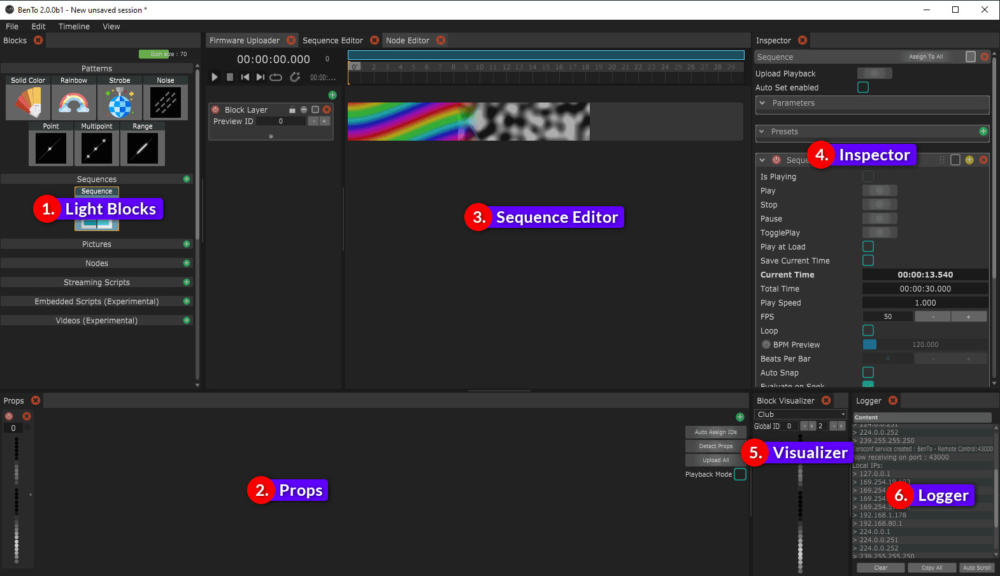
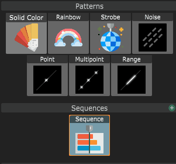
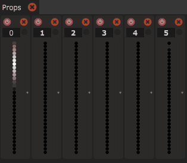
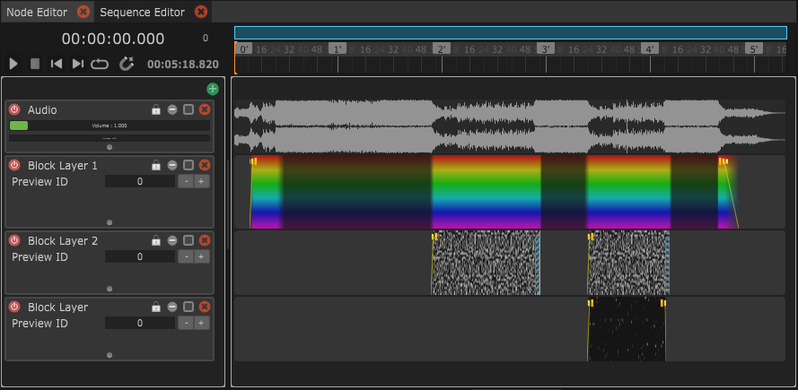
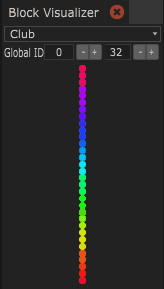
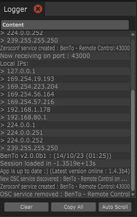
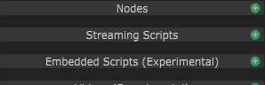
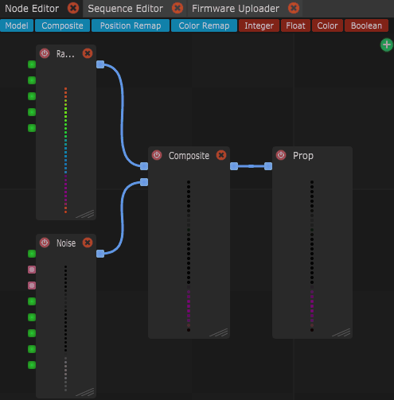
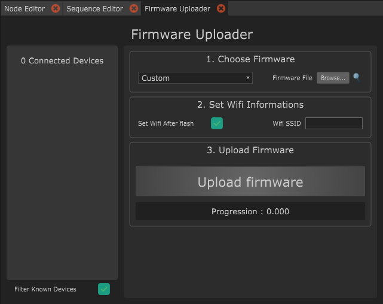

# Interface

The interface can look intimidating at first, but don't worry, it will quickly make sense as we break it down together. Here we go!


The interface is based on a sub-framework called [Organic UI](https://github.com/benkuper/juce\_organicui), which features a ShapeShifter mechanism. Basically, this means that you can change the panel layout as much as you like, and save different layouts depending on what you want to work on.


## 1. Light Blocks

The Light Blocks panel shows the building blocks of a light show. Each Block can be seen as a light effect, that can be assigned to a Prop. When you click a Light Block two things will happen: 1. the Block Visualizer (illustrated with No. 5) shows a preview of the Light Block and 2. the Inspector (illustrated with No. 4) displays the parameter of the selected Light Block.


Try to play a bit with the parameters of the Light Blocks. It's quite intuitive and you can instantly see the result in the Block Visualizer.



For all the fine details about Light Blocks, please check the [Light Blocks](interface.md#1.-light-blocks) section.


<figure><figcaption>
The light blocks panel displays the light building blocks.
</figcaption></figure>

## 2. Props

The Props panel displays a list of Props that you can output your Light Blocks to. Each Prop has a unique prop ID and a representation of the output (aka colors) is displayed. You can create your Props manually by clicking on the green plus icon or detecting Props automatically by pressing "Detect Props".

You can assign a Light Block to a Prop in the following ways:

* Drag and Drop a Light Block on the Prop
* Right-click on a Light Block and select "Assign to all" or select a specific Prop
* Hold the "Alt"-Key (Option-Key on Mac) while clicking on the Light Block to assign to all Props

<figure><figcaption>
Assign to all Props by Right-click > "Assign to all".
</figcaption></figure>

<figure><figcaption>
The Props panel will display a preview of the assigned Light Block.
</figcaption></figure>

## 3. Sequence Editor

The Sequence Editor allows you to create fine-tuned and timed light sequences to music. To be able to edit something in the Sequence Editor you first need to create a Sequence Light Block. You can use the green plus icon next to "Sequences" in the Light Blocks panel.

<figure><figcaption>
Create a Sequence by clicking the green plus icon next to Sequences.
</figcaption></figure>

You can now Drag and Drop Light Blocks into Layers of the Sequence. Light Blocks can be blended into each other and the parameters of the Light Blocks can be animated with keyframes.&#x20;


Want to learn how to create amazing light sequences? \
Head over to the [Creating a Sequence](broken-reference) section!


<figure><figcaption>
The Sequence Editor panel can be used to create precisely timed light sequences.
</figcaption></figure>

## 4. Inspector

The Inspector is your main editing panel, you'll spend a lot of time here! Everything that you select, will show its properties in this panel. You can then edit the parameters of this item.

If you select another item, the parameters in this panel will change to show the newly selected item.

## 5. Visualizer

The Block Visualizer displays a preview of the currently selected Light Block.

<figure><figcaption>
The Block Visualizer.
</figcaption></figure>

## 6. Logger

The Logger is your verbose friend. It will tell you if something went well or failed, as well as other useful information.&#x20;

<figure><figcaption>
The Logger panel.
</figcaption></figure>

## 7. Node Editor

The Node Editor can be used to create new Light Blocks that combine, remap or composite several Light Blocks into one. You can create a new Node Light Block by pressing the green plus icon next to "Nodes" in the Light Block panel.

<figure><figcaption>
Create a Node by clicking the green plus icon next to Nodes.
</figcaption></figure>


Want to learn how to create amazing new Light Blocks aka Nodes? \
Head over to the [Creating with the Node Editor](broken-reference) section!


<figure><figcaption>
The Node Editor panel.
</figcaption></figure>

## 8. Firmware Uploader

In the Firmware Uploader panel you can upload the firmware to your Props.


The [Firmware upload](../getting-started/firmware-upload.md) section shows you in detail how to do it!


<figure><figcaption>
The Firmware Uploader panel.
</figcaption></figure>

