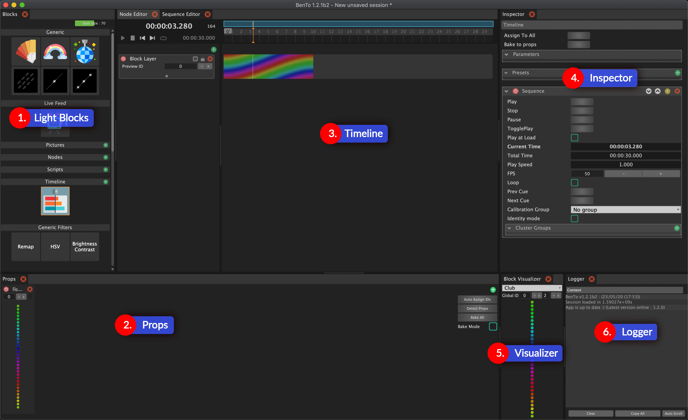

# Interface

The interface can be frightening at first, but worry not, it will quickly make sense as we dissect it together. Here it goes.

### Global notes

The interface is based on a sub-framework called "Organic UI", which features a ShapeShifter mechanism.

Basically, this means that you can change the panel layout as much as you want, and save different layouts depending on what you want to work on.

