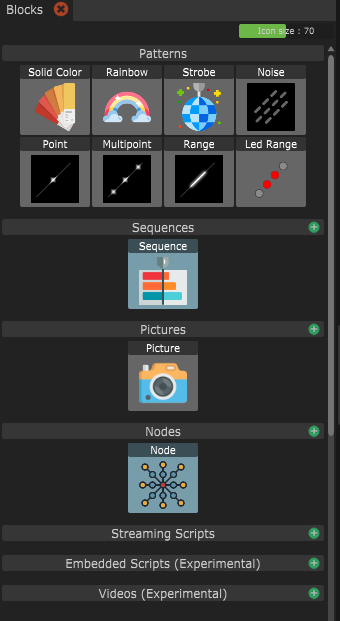

# Introduction

Light Blocks are the fundamental building blocks of Bento. These are the light effects that you use to create your light show. There is different categories of Light Blocks:

* [**Patterns**](generic.md): Basic light effects.
* [**Sequences**](timeline.md): You can arrange Light Blocks in a timeline.
* [**Pictures**](pictures.md): Uses colors from a picture.
* [**Nodes**](nodes.md): Let's you compose Light Blocks to a new more complex light block.
* [**Streaming Scripts**](scripts.md): You can write your own effects using JavaScript code. The code is interpreted on the computer and sent to the Prop.
* [**Embedded Scripts**](../../light-blocks/embedded-scripts-experimental.md) (Experimental): You can write your own effects using TypeScript code, that is compiled into WebAssembly bytecode and then executed on the Prop.
* [**Videos** ](live-feed.md)(Experimental): Picks colors from a video feed based on a prop location on that video texture.

## Parameters

Each Light Block exposes different parameters that affect the output of colors.&#x20;

### Presets

You can create Presets for each light block. The parameters shown at the top of the inspector is the "Default" Preset. You can create your own Preset by clicking on the green plus icon next to "Presets".


Notice how the values and parameter names that are different from the default values are highlighted with bold text. You can reset to the default value by right-clicking on the parameter and selecting "Reset value"


### Inheritance/overriding of parameter values

An important thing to understand is what happens when you use a Preset (including the default Preset) in a Sequence or Node. The parameter values will be marked as overridden to prevent unwanted changes to the Sequence from changing parameters on a Preset level.&#x20;

If you actually want changes of the Preset to automatically propagate to the Sequence or Node level, you can right-click and "Reset value" on all parameters that you want this behaviour.

&#x20;
