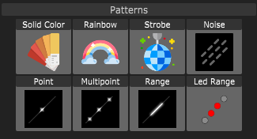

# Patterns

The Patterns Light Blocks contain the most basic light effects:

* **Solid color**: Displays one color on all LEDs
* **Rainbow**: Displays a rainbow effect
* **Strobe**: Let's you strobes the LEDs in two colors
* **Noise**: Creates a noise pattern
* **Point**: Displays a single point
* **Multipoint**: Displays multiple points
* **Range**: Displays one color on a relative area of the Prop
* **LED Range**: Displays one color on an area of the Prop based on absolute pixel counts


Try to play a bit with the parameters of the Light Blocks. \
It's quite intuitive and you can instantly see the result in the Block Visualizer.


