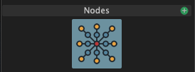

# Nodes

The Node editor can be used to create new light blocks that combine, remap or composite several light blocks into one. You can create a new Node light block by pressing the green plus icon next to "Nodes" in the light block panel.

After creating the new Node light block it will create a Prop node in the [Node Editor panel](../the-node-editor.md)

