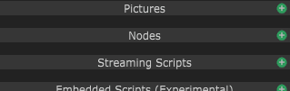
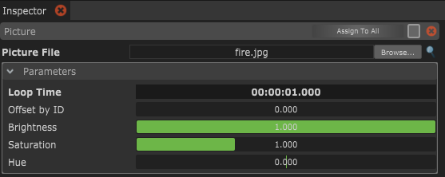
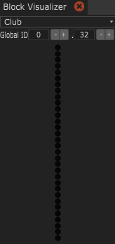

# Pictures

With a Pictures Light Block you can use a picture as the input for light effects. The colors for one frame is defined by the pixels from top to bottom. The horizontal axis is used to animate the colors over time.

You can create a new Pictures Light Block by clicking on the green icon next to "Pictures" in the Light Block panel.

<figure><figcaption>
Creating a Pictures Light Block.
</figcaption></figure>

Select a picture file through the "Picture file" parameter in the inspector. Adjust the remaining parameters to fit the effect you want to accomplish.

<figure><figcaption>
Pictures Light Block parameters.
</figcaption></figure>

Try different pictures and try to understand why some pictures work better then others. Increase the saturation make those colors stronger.

<figure><figcaption>
Visualizer displaying a fire ball image.
</figcaption></figure>
