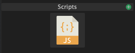

# Scripts

Script light blocks enables to you to create custom effects by writing JavaScript code. You can create a new Script light block by clicking the green plus icon next to "Scripts" in the light blocks panel. Then you need to create a new text file in your filesystem. You then select the text file in the file path parameter. Now it's time to add some code to the file.

More info in the [Scripting ](../scripting.md)section


_You can find some_ [_example script files on the Github page_](https://github.com/benkuper/BenTo) _of the Bento project._


