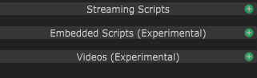
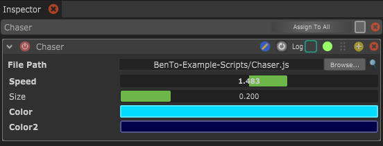

# Streaming Scripts

With a Streaming Script Light Block you can create custom effects by writing JavaScript code. This is especially interesting if you want to create a Light Effect that uses the Motion sensor data.

You can create a new Streaming Script Light Block by clicking the green plus icon next to "Streaming Scripts" in the light blocks panel.&#x20;

<figure><figcaption><p>Creating a Streaming Script Light Block.</p></figcaption></figure>

Then you need to create a new text file in your filesystem. You then select the text file in the file path parameter. Now it's time to add some code to the file.


_You can find some_ [_example script files on the Github page_](https://github.com/benkuper/BenTo) _of the Bento project._



Here is an example of a simple chaser effect:

```javascript
script.addFloatParameter("Speed","",1,-5,5);
script.addFloatParameter("Size","", .2,0,1);
script.addColorParameter("Color","",0xffff00ff);
script.addColorParameter("Color2","",0xff0000ff);

function updateColors(colours, id, resolution, time, params) {
	var pos = (time*params.speed) % (1+params.size) - params.size/2;
	if(params.speed < 0 && pos < params.size/2) pos += 1 + params.size;

	for(var i=0;i<resolution;i++)
	{
		var col;
		var rel = i*1.0/resolution;
		if(rel > pos-params.size/2 && rel < pos+params.size/2) col = params.color;
		else col = params.color2;

		colours.set(i,col[0],col[1],col[2],1);	
	}
}
```


<figure><figcaption><p>Parameters added in the Script will show in the Streaming Script Inspector.</p></figcaption></figure>



Want to learn how to create amazing new Light Blocks with Javascript? \
Head over to the "[How to use Streaming Scripts](broken-reference)" section!


