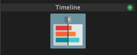

# Timeline

A timeline light block let's you arrange other light blocks into a sequence. It is a powerful mechanism for building light shows timed to music.

You can create a new timeline light block by clicking on the green plus icon next to "Timeline" in the light blocks panel.

When selecting a Timeline block, you will be able to edit in the [Sequence Editor](../the-timeline.md).

