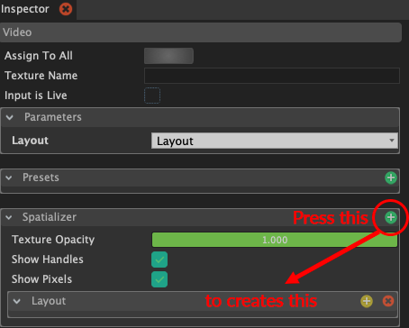
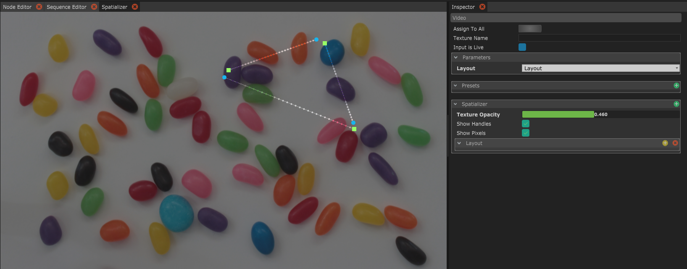
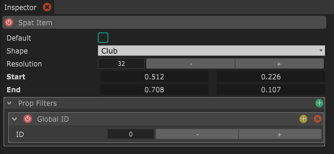

# The Spatializer

You can use the Video light block to receive a spout texture from a different application. [Spout](https://spout.zeal.co/) is a protocol to share a live video feed between application on the same computer. It is integrated in many video software, e.g. Touchdesigner and Resolume.

If you have only one Spout source it will automatically be used. If you have more then one you first need to enter the texture name in the inspector. After that open the "Spatalizer" in the "View" menu.&#x20;

Keep the video block selected so you can edit its parameters. Press the green plus icon in the Spatalizer container. This will create a new layout for you.&#x20;

Now you can right click on the Spatalizer panel and select "Add item". This will create a line indicating a prop. We call this a spat. The prop will pick it's colors along this line.

The circle indicates the bottom of the prop. The square indicates the top of the prop. When you have the prop selected you can define filters in the same way you can use on layers in the timeline.

