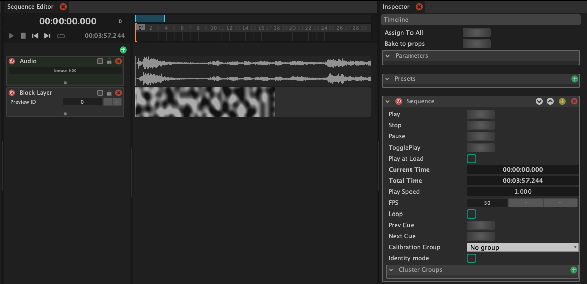
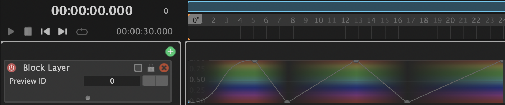
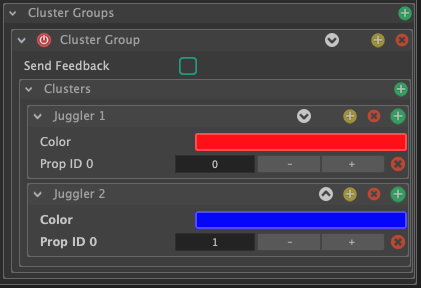

# The Timeline Editor

## Interface

When you have the timeline light block selected the inspector will display the parameters of the timeline. Here you can change e.g. the total time of the timeline and wether or not the sequence should loop.

A timeline can consists of several layers. The block layers can contain light blocks. The audio layers can contain music files. 


**SHORTCUTS AND NAVIGATION  
- Drag the blue bar horizontal / vertical :** Zoom in/out and change the time focus frame  
**- Right click on the blue bar :** Reset the view to a full view of the whole sequence  
**- Ctrl + C, Ctrl + V, Ctrl + D :** Copy, paste, duplicate items \(This applies to blocks and layers. When pasting layers make sure to select the timeline panel\)


## Add a music file

To add a music file click the green plus icon above the layers and select "Audio". Then double click on the  created audio layer and select an audio file from the file dialog.

You can fine tune details of the audio block by clicking on it. This will show it's parameters in the inspector panel. Additionally, you can move the block to change it's start time. You can also use the nudges at the beginning and end of the block to crop the music clip.

## Adding light blocks to a layer

You can add light blocks to a block layer in the following ways:

* Drag and Drop a light block from the light block panel onto the block layer.
* Double-clicking on the block layer will create an empty block. You can then set a light block in it's inspector parameters.
* Copy and Paste from other layers: Select light block, press Ctrl+C =&gt; select layer, press Ctrl+V

The light blocks will display a visual representation of the output.

### Animating parameters

You can animate parameters of the light blocks by right-clicking on the light block and selecting "Edit" and the respective parameter. This will enable a curve automation where you can add keyframes by double-clicking. You can change the interpolation between keyframes by clicking the line between two keyframes.

If you want to control an additional parameter with an automation curve, again right-click on the light block and select the new parameter. This will switch the curve keyframe to the newly selected parameter.

After creating the keyframes, right-click on the light block and select "Clear automation editor". This will let you manipulate the light block in the usual way.


Please read the following instruction on how parameters of light blocks are inherited and overriden in timelines:  
[Inheritance / overriding of parameters](light-blocks/#inheritance-overriding-of-parameter-values)


### Targeting a prop

The layers are blended and selected for props on different rules. The blend mode can be defined in the layer properties in the inspector panel. 

If you select a layer you can add Prop filters in the inspector panel. When you click the green plus icon next  to "Prop Filters" you will get a selection of:

* Global ID: This filter targets a specific prop ID. \(The prop ID is the number displayed for each Prop in the prop panel\)
* Family: This filter targets a family of props, e.g. Flowtoy props.
* Type: This filter targets a type of props, e.g. club.
* Cluster: This will target a cluster of props of the timeline. How to define a cluster is described below.
* Script: This will run a script to determine if the layer should be used for the prop.

#### Creating a Cluster Group

A cluster group can help you target an arbitrary defined group of props differently. This can for example be useful if you want to have different effects for props that are handled by one person.

 To create a new cluster group, select the timeline light block in the light block panel and in its inspector parameters click the green plus icon next to "Cluster Groups". This will create a new cluster group.

Inside of a cluster group you can define clusters of props. For each cluster you can add props with their global prop ID, by clicking the green plus icon next to the Cluster container. The example image shows one  cluster group called "Cluster Group" with two clusters "Juggler 1" and "Juggler 2". They have a different color associated with each cluster. This color can be displayed on the clubs by selecting the cluster group in the timeline property called "Calibration Group" and by activating the property "Identity mode". The cluster group color will be displayed at the top of the prop, the local prop ID will be displayed at the bottom of the prop.This information is also baked/uploaded to the prop.

