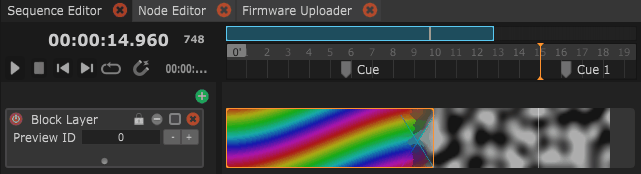

# Cheat Sheet (Shortcuts & UI tips)

### Editing Parameters

Generally in the software, trying to right-click and see if there are more options is a good idea.\
For example, right clicking on a Parameter in the Inspector allows you to have extended options about it. You can change its range (if allowed), send it to the Dashboard, copy its script or OSC control address, etc.&#x20;

### Common shortcuts

| Shortcut                     | Description                                                                                                                                                                  |
| ---------------------------- | ---------------------------------------------------------------------------------------------------------------------------------------------------------------------------- |
| (Ctrl or ⌘) + N              | Creates a new file                                                                                                                                                           |
| (Ctrl or ⌘) + O              | Opens a file                                                                                                                                                                 |
| (Ctrl or ⌘) + Shift + O      | Opens the last opened file                                                                                                                                                   |
| (Ctrl or ⌘) + S              | Saves the current file                                                                                                                                                       |
| (Ctrl or ⌘) + Shift + S      | Saves the current file as a new file (Save as...)                                                                                                                            |
| (Ctrl or ⌘) + ;              | Edit Preferences (in the Inspector)                                                                                                                                          |
| (Ctrl or ⌘) + ,              | Edit Project Settings (saved in the file)                                                                                                                                    |
| (Ctrl or ⌘) + C              | Copies the current selection                                                                                                                                                 |
| (Ctrl or ⌘) + V              | 
Paste the current selection This will only work when pasting items of the same type.
                                                                               |
| (Ctrl or ⌘) + X              | Cuts the current selection                                                                                                                                                   |
| (Ctrl or ⌘) + D              | Duplicates the current selection                                                                                                                                             |
| Alt + O                      | 
Import a LiLNut file and add all the content of this file to the existing one.

Content can be Modules, States, Custom Variables, Module Router and Sequences
 |
| Alt + S                      | 
Exports the current selection to a LilNut file.

Content can be Modules, States, Custom Variables, Module Router and Sequences
                                |
| (Ctrl or ⌘) + Select an Item | Toggles an item's selection state                                                                                                                                            |
| Shift + Select an Item       | Select all elements up to this one                                                                                                                                           |

### Inspector shortcuts

| Shortcut                    | Description                           |
| --------------------------- | ------------------------------------- |
| On a Slider or number label |                                       |
| Alt + Drag                  | Decreases the sensitivity of the drag |
| Shift + Drag                | Increases the sensitivity of the drag |

<figure><figcaption>
Changing parameters while holding down Alt or Shift will change the sensitivity.
</figcaption></figure>

### Sequence shortcuts

#### Sequence Manipulation

| Shortcut                                          | Description                                         |
| ------------------------------------------------- | --------------------------------------------------- |
| 
Drag the blue bar horizontal / vertical
 | Zoom in/out and change the time focus frame         |
| Right click on the blue bar                       | Reset the view to a full view of the whole sequence |

| Shortcut                                    | Description                                                                |
| ------------------------------------------- | -------------------------------------------------------------------------- |
| Right-click + Drag on the blue bar          | Selective zoom on a part of the timeline (absolute)                        |
| Right-click + Drag on the numbers           | Selective zoom on a part of the timeline (relative)                        |
| (Ctrl or ⌘) + Left-click drag on the number | Show menu for adding/removing timespan                                     |
| Shift + drag the time needle                | Snap the time to timeline elements (cues, triggers, other mapping keys...) |

| Shortcut                             | Description                                                                |
| ------------------------------------ | -------------------------------------------------------------------------- |
| Double-click on the timeline numbers | Create a Time Cue                                                          |
| Shift + drag a cue                   | Move the trigger with snapping (time bar, triggers, other mapping keys...) |

#### Parameter Automation (Keyframe Editing)

| Shortcut                     | Description                                                                                                                   |
| ---------------------------- | ----------------------------------------------------------------------------------------------------------------------------- |
| Double click on empty space  | Create a new key at that position                                                                                             |
| Double click on curve        | 
Adds a point, keeping the overall shape intact
                                                                      |
| Shift + drag a key           | Keep key's value, only move position                                                                                          |
| Alt + drag a key             | Keep key's position, only move value                                                                                          |
| Shift + Alt + drag a key     | Keep key's value, only move position with snapping on other layers elements (time bar, cues, triggers, other mapping keys...) |
| (Ctrl or ⌘) + click on curve | Change the curve easing type                                                                                                  |
| (Ctrl or ⌘) + shift + drag   | Manually draw the curve                                                                                                       |

### Launching from terminal / CLI

`./Bento [-r] [-f file] [-headless] [-forceGL / -forceNoGL] [<file>]`

`-r` reset preferences

`-f` open file (works also by adding the file name at the end without -f)

`-headless` run without gui (no window)

`-forceGL / -forceNoGL` force setting the "use opengl renderer" value, to use 3d acceleration or not (forceNoGL can be handy when having problem with graphics drivers)

