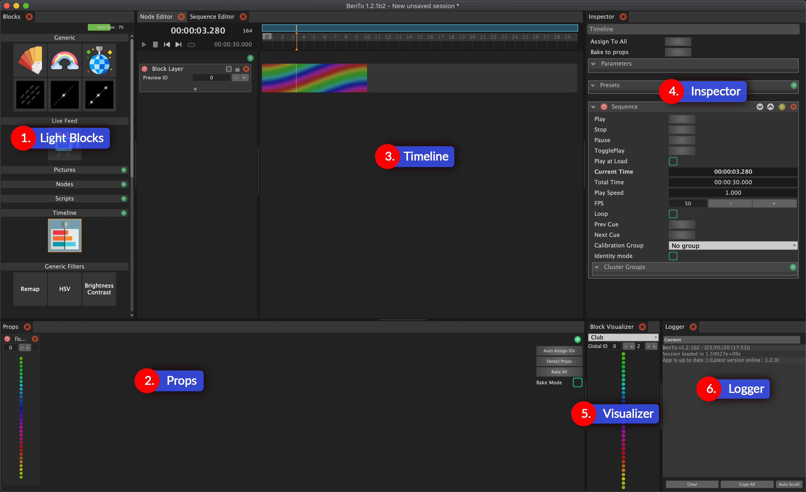

# Interface

The interface can look intimidating at first, but don't worry, it will quickly make sense as we break it down together. Here we go.

### Global notes

The interface is based on a sub-framework called "Organic UI", which features a ShapeShifter mechanism.

Basically, this means that you can change the panel layout as much as you like, and save different layouts depending on what you want to work on.

## 1. Light Blocks

The light blocks panel shows the building blocks of a light show. Each block can be seen as a light effect, that can be assigned to a prop. When you click a light block two things happen: 1. the block visualizer \(illustrated with no. 5\) shows a preview of the light block and 2. the inspector \(illustrated with no. 4\) shows the parameter of the selected light block.

Try to play a bit with the parameters of the light blocks. It's quite intuitive and you can instantly see the result in the block visualizer.

## 2. Props

The props panel displays a list of props that you can output your light blocks to. Each prop has a unique prop ID and a representation of the output is displayed. You can can create your props manually by clicking on the green plus icon or detecting props automatically by pressing "Detect Props".

You can assign a light block to a prop in the follow ways:

* Drag and Drop light block on the prop
* Right click on light block and select "Assign to All" or select a specific prop
* Hold the "Alt"-Key \(Option-Key on Mac\) while clicking on the light block

## 3. Timeline

To be able to edit something in the timeline \(sequence editor\) you need to create a timeline light block. You can use the green plus icon next to "Timeline" in the Light Blocks panel.

In the timeline you can arrange light blocks in layers. You can also load music to create to light blocks that go with the music.

## 4. Inspector

The Inspector is your main editing panel, you'll spend a lot of time there ! Anything you can select in the software will be showed in detail in this panel. You can then edit all the properties of this item.  
If you select another item, then the elements in this panel will change to show the newly selected item.

## 5. Visualizer

The block visualizer displays a preview of the currently selected light block.

## 6. Logger

The Logger is your verbose friend. It will tell you if something went well or failed, as well as other useful information. 

